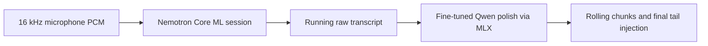

# Develop

Build, test, customize, and understand the Unramble codebase.

## Prerequisites

- macOS 14+
- Xcode 16+
- Python 3.10+ for explicit model downloads
- [xcodegen](https://github.com/yonaskolb/XcodeGen) (`brew install xcodegen`)

## Build

    make models          # download the pinned local model pack
    make verify-models   # verify local assets without network access
    make build           # debug build (generates the project if missing)
    make test            # fast tests (~5s)
    make test-all        # add Keychain suites (triggers a login prompt)
    make clean           # clean build output
    make xcode           # open in Xcode

`make models` is the only model command that uses the network. It creates its
own disposable Python environment, downloads immutable Hugging Face revisions,
and verifies the resulting pack. Build and archive commands only perform
offline verification. The built app never downloads or installs model assets
at runtime.

`UNRAMBLE_TEST_KEYCHAIN=1` enables Keychain tests (require macOS login
Keychain access, trigger password prompts). `UNRAMBLE_TEST_OPENAI=1`
enables live tests that hit the real OpenAI API and require
`OPENAI_API_KEY` to be set. `UNRAMBLE_TEST_OPENAI_BENCH=1` additionally
enables the latency benchmark suite. `UNRAMBLE_TEST_OPENAI_LONG=1` enables the
separately gated real-speech, five-minute-source, and exact-WAV batch checks.
Set `UNRAMBLE_TEST_OPENAI_REALTIME_PACED=1` to feed the five-minute source in
real time, and set `UNRAMBLE_TEST_EVIDENCE_DIR` to write case-specific JSON.

## Project structure

The repo has two main directories:

**`UnrambleApp/`** — macOS app. Menu bar UI, onboarding, settings, HUD
overlay. Sources are in `Sources/`, bundled HTML and assets in
`Resources/`.

**`UnrambleKit/`** — Swift package with the testable core. The
dictation pipeline, Realtime and HTTP file-transcription OpenAI providers,
the polish pipeline, audio capture, device switching, text injection,
Keychain storage, and the recording state machine. Protocols for every
provider enable dependency injection in tests.

The supported local pipeline is incremental and has one production speech
recognizer:

The cloud path commits continued Realtime items only at detected pauses,
assembles an item-correlated raw transcript, polishes once, and injects once.
A non-silence hard guard with later source invalidates Realtime and transfers
authority to exact-WAV batch recovery. The gated
`CloudDictationLiveHarnessTests` exercise current-policy real speech,
five-minute source scheduling, connection pacing, and exact-WAV recovery.

## Customize

Unramble is designed to be taken apart and reassembled. Edit code,
rebuild, and use the rebuilt binary.

### Change a prompt

The polish prompts live in `UnrambleKit/Sources/UnrambleKit/Prompts/`.
`PolishPipeline.swift` selects and augments them for each backend:

| Constant | File | What it controls |
|----------|------|------------------|
| `systemPromptQwen` | `PolishPromptQwen.swift` | Supported local Qwen polish |
| `systemPromptEnglish` | `PolishPromptEnglish.swift` | Cloud English polish |
| `systemPromptCasual` | `PolishPromptCasual.swift` | Cloud casual-style English polish |
| `systemPromptHindi`, `systemPromptKannada`, `systemPromptTamil` | Matching language prompt files | Cloud polish for explicitly supported languages |
| `systemPromptMinimal` | `PolishPromptMinimal.swift` | Conservative cloud fallback for other languages |

Edit the prompt for the backend and language you want to change. For example,
to make the English cloud polish step produce British English:

    11. British English: use British spelling conventions. "organize" becomes
        "organise", "color" becomes "colour", "center" becomes "centre", etc.

Or to format code identifiers in backticks:

    11. Code identifiers: when the speaker mentions a function, variable,
        class name, or file path, wrap it in backticks. "the render function"
        becomes "the `render` function".

Add the rule to `PolishPromptEnglish.swift` before its final instructions about
language preservation and output format.

### Change a model

Cloud model identifiers are configured at the composition root or as provider
defaults:

| Constant | File | Default | What it does |
|----------|------|---------|-------------|
| `realtimeModel` | `OpenAIStreamingProvider.swift` | `gpt-realtime-2.1` | Production Realtime connection and response polish |
| `sttModel` | `OpenAIStreamingProvider.swift` | `gpt-4o-mini-transcribe` | Realtime transcription |
| `model` | `OpenAIFileTranscriber.swift` | `gpt-4o-mini-transcribe` | HTTP fallback transcription |

The local Nemotron and Qwen repository revisions, selected files, and hashes
are pinned in `scripts/models.sh`. The fine-tuned adapter source is tracked at
`UnrambleApp/ModelSources/qwen3-0.6b-4bit-polish-adapter`; rerun `make models`
after changing it so the generated pack receives the current adapter bytes.

### Rebuild

    make generate   # Regenerate Xcode project
    make build      # Build the app

The debug build is at
`~/Library/Developer/Xcode/DerivedData/Unramble-*/Build/Products/Debug/Unramble.app`.
Launch it directly or replace your installed app with the rebuilt one.

Everything else in `UnrambleKit/Sources/UnrambleKit/Services/` is open
to modification: audio capture, device switching, text injection, the
dictation pipeline state machine, even the Realtime protocol message
construction. The test suite covers every provider and pipeline stage so
regressions are caught quickly.

## App icon

The app icon is a 6-bar waveform squircle. The source SVG is
`UnrambleApp/AppIcon.svg`.

### Regenerating

Requires `rsvg-convert` (install via `brew install librsvg` or Nix):

    rsvg-convert -w 1024 -h 1024 UnrambleApp/AppIcon.svg -o /tmp/AppIcon-1024.png

    mkdir -p /tmp/AppIcon.iconset
    sips -z 16 16     /tmp/AppIcon-1024.png --out /tmp/AppIcon.iconset/icon_16x16.png
    sips -z 32 32     /tmp/AppIcon-1024.png --out /tmp/AppIcon.iconset/icon_16x16@2x.png
    sips -z 32 32     /tmp/AppIcon-1024.png --out /tmp/AppIcon.iconset/icon_32x32.png
    sips -z 64 64     /tmp/AppIcon-1024.png --out /tmp/AppIcon.iconset/icon_32x32@2x.png
    sips -z 128 128   /tmp/AppIcon-1024.png --out /tmp/AppIcon.iconset/icon_128x128.png
    sips -z 256 256   /tmp/AppIcon-1024.png --out /tmp/AppIcon.iconset/icon_128x128@2x.png
    sips -z 256 256   /tmp/AppIcon-1024.png --out /tmp/AppIcon.iconset/icon_256x256.png
    sips -z 512 512   /tmp/AppIcon-1024.png --out /tmp/AppIcon.iconset/icon_256x256@2x.png
    sips -z 512 512   /tmp/AppIcon-1024.png --out /tmp/AppIcon.iconset/icon_512x512.png
    cp /tmp/AppIcon-1024.png /tmp/AppIcon.iconset/icon_512x512@2x.png

    iconutil -c icns /tmp/AppIcon.iconset -o UnrambleApp/Resources/AppIcon.icns

The `.icns` file is referenced by `CFBundleIconFile` in
`UnrambleApp/Info.plist`. After regenerating, run `xcodegen generate`
and rebuild.
